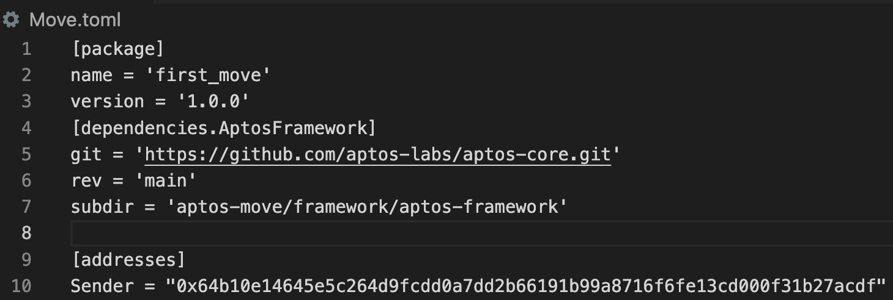

# [Aptos學習筆記#1] Move基本使用 - 開專案、編譯、測試、發佈、執行

新的一年新的機會!! 今年小弟決定開始學習區塊鏈相關技術，所以一樣嘢會將所學分享給大家

## 一. 開一個Move專案

> aptos move init —name <專案名稱>
> 

ex.

```rust
(base) chihhusan@wangzhixuandeMacBook-Pro first_move % aptos move init --name first_move
{
  "Result": "Success"
}
```

結果: 產生一個source資料夾和Move.toml

- source: 用來放我們的Move檔案
- Move.toml: 紀錄我們的Move專案資訊

## 二. 產生一個錢包地址

> aptos init
> 

```rust
(base) chihhusan@wangzhixuandeMacBook-Pro first_move % aptos init
Configuring for profile default
Choose network from [devnet, testnet, mainnet, local, custom | defaults to devnet]
devnet
Enter your private key as a hex literal (0x...) [Current: None | No input: Generate new key (or keep one if present)]

No key given, generating key...
Account 64b10e14645e5c264d9fcdd0a7dd2b66191b99a8716f6fe13cd000f31b27acdf doesn't exist, creating it and funding it with 100000000 Octas
Account 64b10e14645e5c264d9fcdd0a7dd2b66191b99a8716f6fe13cd000f31b27acdf funded successfully

---
Aptos CLI is now set up for account 64b10e14645e5c264d9fcdd0a7dd2b66191b99a8716f6fe13cd000f31b27acdf as profile default!  Run `aptos --help` for more information about commands
{
  "Result": "Success"
}
```

備註: 會詢問network要用哪種，我這邊選devnet來當開發用

將地址複製到Move.toml中，並寫入<錢包名稱> = “0x<錢包地址>”



## 三. 執行第一支Move檔案 - Hello Blockchain

拿官網的範例 - hello_blockchain來試試看編譯、測試跟發佈

[aptos-core/hello_blockchain.move at main · aptos-labs/aptos-core](https://github.com/aptos-labs/aptos-core/blob/main/aptos-move/move-examples/hello_blockchain/sources/hello_blockchain.move)

### 3-1. 撰寫第一支Move程式

創建一個Move檔在source資料夾內，取名hello_blockchain.move，把官網的程式碼貼上

需要修改hello_blockchain，因為我們剛剛設定的地址別名是Sender

```rust
module Sender::message {
    use std::error;
    use std::signer;
    use std::string;
    use aptos_framework::account;
    use aptos_framework::event;

//:!:>resource
    struct MessageHolder has key {
        message: string::String,
        message_change_events: event::EventHandle<MessageChangeEvent>,
    }
//<:!:resource

    struct MessageChangeEvent has drop, store {
        from_message: string::String,
        to_message: string::String,
    }

    /// There is no message present
    const ENO_MESSAGE: u64 = 0;

    public fun get_message(addr: address): string::String acquires MessageHolder {
        assert!(exists<MessageHolder>(addr), error::not_found(ENO_MESSAGE));
        *&borrow_global<MessageHolder>(addr).message
    }

    public entry fun set_message(account: signer, message: string::String)
    acquires MessageHolder {
        let account_addr = signer::address_of(&account);
        if (!exists<MessageHolder>(account_addr)) {
            move_to(&account, MessageHolder {
                message,
                message_change_events: account::new_event_handle<MessageChangeEvent>(&account),
            })
        } else {
            let old_message_holder = borrow_global_mut<MessageHolder>(account_addr);
            let from_message = *&old_message_holder.message;
            event::emit_event(&mut old_message_holder.message_change_events, MessageChangeEvent {
                from_message,
                to_message: copy message,
            });
            old_message_holder.message = message;
        }
    }

    #[test(account = @0x1)]
    public entry fun sender_can_set_message(account: signer) acquires MessageHolder {
        let addr = signer::address_of(&account);
        aptos_framework::account::create_account_for_test(addr);
        set_message(account,  string::utf8(b"Hello, Blockchain"));

        assert!(
          get_message(addr) == string::utf8(b"Hello, Blockchain"),
          ENO_MESSAGE
        );
    }
}
```

### 3-2. 編譯

> aptos move compile
> 

ex.

```rust
(base) chihhusan@wangzhixuandeMacBook-Pro first_move % aptos move compile
Compiling, may take a little while to download git dependencies...
INCLUDING DEPENDENCY AptosFramework
INCLUDING DEPENDENCY AptosStdlib
INCLUDING DEPENDENCY MoveStdlib
BUILDING first_move
{
  "Result": [
    "64b10e14645e5c264d9fcdd0a7dd2b66191b99a8716f6fe13cd000f31b27acdf::message"
  ]
}
```

執行完會產生一個build資料夾


### 3-3. 單元測試

需要將官網中另一支用來測試hello_blockchain的程式也一併複製下來，在source資料夾中一樣創建一個Move檔叫hello_blockchain_test.move，一樣要把hello_blockchain改成Sender喔

```rust
#[test_only]
module Sender::message_tests {
    use std::signer;
    use std::unit_test;
    use std::vector;
    use std::string;

    use hello_blockchain::message;

    fun get_account(): signer {
        vector::pop_back(&mut unit_test::create_signers_for_testing(1))
    }

    #[test]
    public entry fun sender_can_set_message() {
        let account = get_account();
        let addr = signer::address_of(&account);
        aptos_framework::account::create_account_for_test(addr);
        message::set_message(account,  string::utf8(b"Hello, Blockchain"));

        assert!(
          message::get_message(addr) == string::utf8(b"Hello, Blockchain"),
          0
        );
    }
}
```

執行測試

> aptos move test
> 

ex.

```rust
(base) chihhusan@wangzhixuandeMacBook-Pro first_move % aptos move test
INCLUDING DEPENDENCY AptosFramework
INCLUDING DEPENDENCY AptosStdlib
INCLUDING DEPENDENCY MoveStdlib
BUILDING first_move
Running Move unit tests
[ PASS    ] 0x64b10e14645e5c264d9fcdd0a7dd2b66191b99a8716f6fe13cd000f31b27acdf::message::sender_can_set_message
[ PASS    ] 0x64b10e14645e5c264d9fcdd0a7dd2b66191b99a8716f6fe13cd000f31b27acdf::message_tests::sender_can_set_message
Test result: OK. Total tests: 2; passed: 2; failed: 0
{
  "Result": "Success"
}
```

### 3-4. 發佈Move

接下來就是發佈上去了!!

> aptos move publish
> 

ex.

```rust
(base) chihhusan@wangzhixuandeMacBook-Pro first_move % aptos move publish
Compiling, may take a little while to download git dependencies...
UPDATING GIT DEPENDENCY https://github.com/aptos-labs/aptos-core.git
INCLUDING DEPENDENCY AptosFramework
INCLUDING DEPENDENCY AptosStdlib
INCLUDING DEPENDENCY MoveStdlib
BUILDING first_move
package size 1816 bytes
Do you want to submit a transaction for a range of [728800 - 1093200] Octas at a gas unit price of 100 Octas? [yes/no] >
yes
{
  "Result": {
    "transaction_hash": "0xf818d9984367b761a4340a97b24e6f6b49e29eeef55722ba4859f2e0e596b769",
    "gas_used": 7288,
    "gas_unit_price": 100,
    "sender": "64b10e14645e5c264d9fcdd0a7dd2b66191b99a8716f6fe13cd000f31b27acdf",
    "sequence_number": 0,
    "success": true,
    "timestamp_us": 1673149572302249,
    "version": 14613208,
    "vm_status": "Executed successfully"
  }
}
```

### 3-5. 查看發佈上去了嗎

大家可以連到區塊鏈瀏覽器地址: [https://explorer.aptoslabs.com/](https://explorer.aptoslabs.com/)，搜尋字的的錢包地址看看，就看到了我剛剛發佈的Move了!!


### 3-6. 執行函數

> aptos move run --function-id 'default::message::set_message' --args 'string::Hello Move!’
> 

後面Hello Move! 大家可以自行塞入想要的字串

ex.

```rust
(base) chihhusan@wangzhixuandeMacBook-Pro first_move % aptos move run --function-id 'default::message::set_message' --args 'string::Hello Move!'
Do you want to submit a transaction for a range of [40800 - 61200] Octas at a gas unit price of 100 Octas? [yes/no] >
yes
{
  "Result": {
    "transaction_hash": "0xd77984f3efbde9796d0577bb06a3cab4bb7b69749afe59fd60909dd3741739ad",
    "gas_used": 408,
    "gas_unit_price": 100,
    "sender": "64b10e14645e5c264d9fcdd0a7dd2b66191b99a8716f6fe13cd000f31b27acdf",
    "sequence_number": 2,
    "success": true,
    "timestamp_us": 1673151366638469,
    "version": 14626044,
    "vm_status": "Executed successfully"
  }
}
```

接下來來查看我們執行的函數，連結到下面的網址

> https://fullnode.devnet.aptoslabs.com/v1/accounts/<錢包地址>/resource/0x<錢包地址>::message::MessageHolder
> 

ex.

[https://fullnode.devnet.aptoslabs.com/v1/accounts/64b10e14645e5c264d9fcdd0a7dd2b66191b99a8716f6fe13cd000f31b27acdf/resource/0x64b10e14645e5c264d9fcdd0a7dd2b66191b99a8716f6fe13cd000f31b27acdf::message::MessageHolder](https://fullnode.devnet.aptoslabs.com/v1/accounts/64b10e14645e5c264d9fcdd0a7dd2b66191b99a8716f6fe13cd000f31b27acdf/resource/0x64b10e14645e5c264d9fcdd0a7dd2b66191b99a8716f6fe13cd000f31b27acdf::message::MessageHolder)


太興了!! 大功告成，我們開始踏入了Aptos Move的領域了